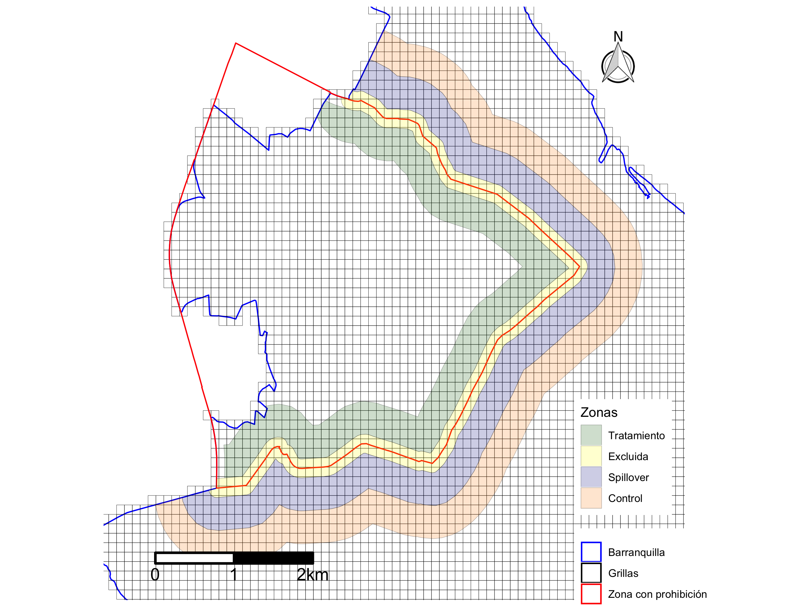

<h2 align = "center">Datos y estrategia empírica</h2>

Estudiamos los efectos de las restricciones a motocicletas sobre los principales delitos contra la propiedad y la vida. Los delitos contra la propiedad son hurto a personas, automotores, residencias y comercio, que pueden ser violentos (atraco, fleteo, raponazo y forcejeo) o no violentos (engaño, factor de oportunidad y cosquilleo). La fuente para estos datos es el Sistema de Información Estadístico, Delincuencial, Contravencional y Operativo (SIEDCO) de la Policía Nacional de Colombia. Los datos son georeferenciados y, además de las coordenadas del delito, la Policía registra la hora y la fecha, el arma empleada y algunas características básicas de las víctimas.

Con el fin de estandarizar la información, se crea una grilla de 50 metros por 50 metros y se calcula el número de delitos ocurridos en cada celda, por mes y tipo de delito. Esta medición es más precisa que otras alternativas que utilizan la manzana o el tramo de vía como unidad de observación al ser comparable entre ellas y al generar menos problemas de clasificación cuando el delito tiene lugar en una esquina. Los polígonos representando las áreas afectadas por las diferentes restricciones se delimitan a partir de los decretos de las respectivas alcaldías. 

A partir de estos polígonos, se calcula la distancia entre los centroides de cada celda y el límite de la zona de restricción. Las celdas de tratamiento son aquellas que están dentro de las zonas de restricción. Con el fin de que las celdas sean lo más comparables posibles, se restringen las celdas de tratamiento a aquellas que están a menos de 450 metros de la frontera. Por fuera del área de restricción, clasificamos las celdas en dos grupos, dependiendo de la distancia a la frontera. Entre 0 y 450 metros de la frontera, se denominan "spillover", las cuales nos permiten saber si hubo algún tipo de desplazamiento espacial del crimen producto de la restricción. 

Las celdas ubicadas entre 450 y 800 metros son clasificados como controles. Para garantizar que la muestra esté balanceada, se excluyen celdas de tratamiento que no tienen zonas de spillover contiguas, y viceversa. Así mismo, se excluyen las celdas que están a menos de 100 metros del limite (diseño tipo *donut*) con el fin reducir problemas de medición en la vecindad del límite. Ilustramos lo anterior en el Gráfico <a href='#fig1' id='fig1'> 1 </a>, en el que se presenta el límite de la zona de restricción de acompañante hombre de Barranquilla (línea roja), y las correspondientes zonas de tratamiento (verde), spillover (morado), control (azul) y exclusión (amarillo). 

                

Identificamos los efectos causales de las distintas restricciones utilizando modelos de diferencia-en-diferencias, que comparan celdas de tratamiento, spillovers y control, antes y después de la entrada en vigencia de la restricción. El modelo de base es el siguiente: 

$$ y_{it}  =  \psi_1 Treated_{i} \times Post_{t} +  \psi_2 Spillover_{i} \times Post_{t} + \lambda_{i} + \tau_{t} + \varepsilon_{it} $$

donde ${y}_{it}$ es el número de delitos cometidos en la celda ${i}$ durante el mes ${t}$. La variable $Treated_{i}$ toma el valor 1 si la celda está en la zona de restricción y 0 si no. La variable $Spillover_{i}$ toma el valor 1 si la celda está en la zona de Spillover y 0 si no. La variable $Post_{t}$ es igual a 1 para los meses siguientes a la implementación de la restricción y 0 de lo contrario. La especificación principal del modelo se hace en una ventana de 6 meses alrededor de la fecha en que inicia cada política, con datos mensuales. Todas las regresiones controlan por efectos fijos de celda ($\lambda_{i}$) y mes ($\tau_{t}$), que controlan por características observadas y no observadas de cada zona y choques comunes a la ciudad. Los errores están clusterizados a nivel de celda.

 

<h4 align = "center"> Gráfico 1: Celdas de tratamiento, spillover y control (Barranquilla) </h4>

 

